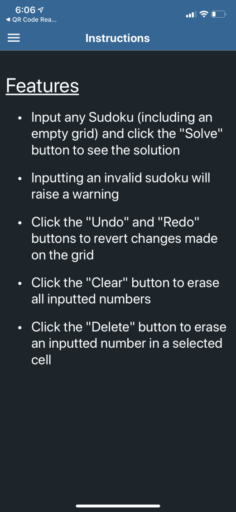

# Sudoku Solver Mobile Application

## Table of Contents

[Brief Overview](#headers)  
[About Us](#about)  
[App Walkthrough](#walkthrough)  
[Technologies Used](#technology)  
&emsp;&emsp;[React Native](#reactnative)  
&emsp;&emsp;[Expo](#expo)  
&emsp;&emsp;[Javascript](#javascript)  
&emsp;&emsp;[CSS](#css)  
[Features](#features)  
[File Descriptions](#files)  

## Brief Overview
This project is a Sudoku solver mobile application, which utilizes the React Native framework. The app can run on iOS and Android devices and offers users the ability to solve any Sudoku as a means of checking their own solutions or quickly solving difficult puzzles they encounter. The overall goal of this application is to provide numerous options when inputting the Sudoku, coupled with an intuitive interface and simple aesthetic.

## About Us
This mobile application was co-created and designed from scratch by <b>Ayush Garg</b> and <b>Suchit Sharma</b> in the summer of 2020.

Wanting an easy way to solve Sudokus we encountered, we embarked upon this project to design our very first mobile application, starting as complete beginners and gradually learning and improving throughout the process.

Check out some of our other projects on GitHub: 

<b>
Ayush Garg: <a href="https://github.com/ayushgarg-ag" target="_blank">GitHub</a>

Suchit Sharma: <a href="https://github.com/ssharma919" target="_blank">GitHub</a>
</b>

Learn more about us on our Linkedin pages: 

<b>
Ayush Garg: <a href="https://www.linkedin.com/in/ayush-garg-ag/" target="_blank">LinkedIn</a>

Suchit Sharma: <a href="https://www.linkedin.com/in/suchit-sharma-988247155/" target="_blank">LinkedIn</a>
</b>

For any questions, reporting of bugs, or requests for additional features, email us at 
agss.projects@gmail.com.

## App Walkthrough

### Inputting a Sudoku

### Finished Solution

### Side Menu

### About Us

### Instructions

## Technologies Used

### React Native
+ *Class components* render our custom components (e.g. `Header`) and already built-in components (e.g. `View`, `TextInput`, `StyleSheet`) on the page, as well as handle state management

+ *Functional components*, such as our `Header` component, are used to call functions from other components in the process of dealing with user interaction and updates to state

+ *Arrow functions* are used to decrease the app’s memory consumption by avoiding the need to `bind()` state variables

+ *Conditional rendering* is implemented in order to vary the display based on certain user actions, such as if the user inputted a valid Sudoku or not

+ *Events*, such as `onChange` and `onFocus`, are used to notify of user interaction with the app and call the respective event handler

+ *Event handlers* are placed as methods in the component class to take the appropriate action after user interaction with the Sudoku grid or option buttons

+ *React Native lifecycle* is utilized to monitor the mounting, updating, and unmounting phases. The main methods called in this process for our purposes are the `constructor()`, `render()`, and `componentDidMount()` methods.

+ *Props* are passed into our components to send along data, define the constructor, and re-use code in many different parts of the app

+ *State* stores property values in the constructor to be used and changed through events and event handlers. State variables included values for all 81 cells, the user’s input history, and the item being focused on at the moment

+ *Drawer navigation* is used as the primary method of navigation in the application. The root drawer navigator contains each stack navigator, which contains pages. The drawer is used to create a seamless side menu bar that can be opened by clicking the menu icon

+ *Stack navigation* is used to navigate between multiple layers of pages. In this application, only one stack, `SudokuStack`, contains multiple pages. Once a user inputs a Sudoku, stack navigation is utilized to pass information from the input page to the solution page. This information is then used to display the correct solution. The other stacks are used to create consistent layouts between the pages.

### Expo
+ The *Expo framework* was utilized to develop a universal iOS and Android mobile application in React Native and Javascript

+ An *Expo container app* allowed for testing features as they were developed and ensuring a consistent layout on numerous simulated iOS and Android mobile devices

### Javascript
+ *Object-oriented programming* creates the Sudoku object that is used to solve and validate the Sudoku inputted by the user

+ *Recursion* is the main technique used to implement the solving algorithm. It works by inputting a valid number in each cell and recursively filling all cells until all numbers are valid

### CSS
+ *CSS flexboxes* are used to design a page layout for the dynamic user interface that promotes consistency in alignment and positioning

+ *Responsive dimensions and design techniques* are employed to create an app that creates a predictable layout on any screen size or device

+ *Mobile device dimensions* of the user are taken into account to adjust for the smaller dimension when constructing the grid

## Features

### Inputting a Sudoku
+ This Sudoku application allows users to input and solve any Sudoku, no matter the amount of numbers filled (as long as it is valid). If the inputted Sudoku is invalid, a warning message will appear and allow users to go back to change the inputs

### Solving a Sudoku

+ Input any valid Sudoku and the solver will create a correct solution that follows all Sudoku rules. The solution will return very quickly, even to the world’s hardest Sudoku!

### Options
+ The *"Undo"* and *"Redo"* buttons revert changes made on the grid to simplify the process and quickly fix errors in their inputs
+ The *"Clear"* button erases all inputted numbers in case the user would like to restart the process of inputting
+ The *"Delete"* button erases an inputted number in a selected cell if an error has been made while inputting

### Menu
+ The menu icon at the top left of the screen can be clicked to open the side menu, which showcases three separate pages to which users can navigate
+ Each page includes the menu icon for ease of access

## File Descriptions

#### `/App.js`
This file contains the root code of all pages and stacks of the application. Every stack is housed within a drawer navigator inside this file.

#### `/pages/InputSolve.js`  and  `/pages/Solution.js`
`InputSolve.js` initializes all the states of each cell in the grid while also handling specific events in the cells. Selecting the numbers 1-9 while focused on a certain cell changes the state of that cell. 

Once the "Solve" button is clicked, the states are passed using stack navigation to `Solution.js`, which imports the Sudoku class from `Sudoku.js` and uses the solve method to display a solution on the screen.

#### `/pages/About.js`  and  `/pages/Instructions.js`
These files contain information regarding the creators of the application (About Us) and the instructions for how to use the application.

#### `/stacks`
This folder contains all the stack navigators. `SudokuStack.js` contains the two pages that involve solving a sudoku with `InputSolve.js` being the default page, while the other two stacks exist to preserve a consistent layout among the pages.

#### `/components/Header.js`
This file contains a custom header component. This component fills a designated space at the top of the screen and houses a distinct title and a menu icon, which has its own event handlers.

#### `/Sudoku.js`
This file contains the Sudoku class. The Sudoku object is initialized with a passed 2D list. This list is then used to accomplish two main goals of solving the passed list and identifying if the passed list is a valid Sudoku. 

Solving: The solver utilizes a backtracking algorithm. Using the numbers already in the cell, it iterates over every cell and attempts to fill each one with a valid number. If the inputted number results in an invalid Sudoku, then a different valid number takes its place. The grid is then filled recursively until all cells contain a valid number. This algorithm follows depth-first traversing, where it attempts to input as many valid numbers as possible before backtracking.

Validation: The validator checks every row, column, and box, and if there exists more than one instance of a number from 1-9, then the Sudoku is invalid.

**For a more in-depth look into the inner-workings of these files, feel free to open them in the repository and look at the documentation provided.**